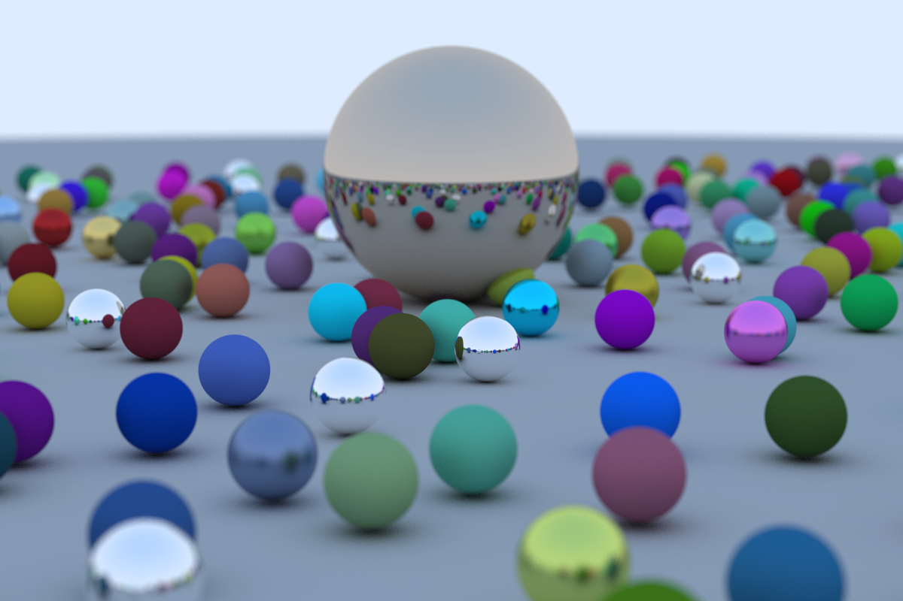

# Tracer
Ray tracer written in Rust for fun following [Ray tracing in One Weekend](https://raytracing.github.io/books/RayTracingInOneWeekend.html).

This code is probably very inefficient, but provided me a great opportunity to learn more rust and to structure a more "ambitious" project.
I hope to keep poking at this to either squeeze out more performance or make more idiomatic code. Currently it is a bit disorganized, as 
I quickly through it together. My hope is to make the dependencies a bit more clean and modular, and to create a few separate binary applications
that show a few example scenes.

# How to run
To run the code just simply run `cargo run --release > render.ppm`. Since the code will just output rendered points to stdout, you will need to 
redirect the application to a file in order to save the work.

Note that the only scene currently available is fairly heavy and may take some time to render.

# Sample Image
Running the render will provide this image.

